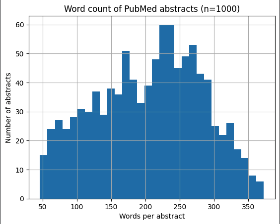

# Chapter 3 — First Measurement

The notebook from Session 1 was still open in another tab. I closed it and started a new one. Clean slate.

The decision came first: of the three sub-questions in the brief, I went with the second. How the language of consciousness shifted from religious to neuroscientific over the last 200 years. Not because it was the most interesting — sub-question 1, the mystics across cultures, still pulls at me harder — but because it was the one I could actually do. Old books are free on Project Gutenberg. Modern science papers are free on PubMed. Both download cleanly. The question has a built-in axis: time. That meant I could make a chart on day one, and a chart on day one is worth more right now than a perfect question.

The point of this project is not to answer the philosophy. It's to learn data science. The question is the excuse.

GitHub got set up. The repo is real now, sitting at a URL, empty but waiting. That alone felt like a small thing crossed off a long list.

Then Colab. Three libraries installed in one line. Thirty seconds later I was downloading a thousand medical paper abstracts from Hugging Face. The first one I opened was a 2008 study about feeding schoolchildren in Iran — anthropometric indices, p-values, a structured background-methods-results-conclusion shape. Nothing to do with consciousness. That's fine. I'm not measuring the meaning yet. I'm measuring the *texture*.

The first real measurement was word counts. Average abstract: 205 words. Shortest: 46. Longest: 373. Then the histogram:

A lopsided hump that climbs gradually and falls off a cliff just past 300. You could see the journal word limit in the shape of the data. Authors write up to the line and not past it. The rule is invisible in any single abstract but obvious in a thousand of them. That's what data does.

Claude predicted a tighter, more bell-shaped curve before the chart rendered. The actual chart was messier than that. When I pointed at the screen, Claude said so plainly — *the data disagrees with what I told you, the data wins.* I noticed I trusted the conversation more after that than before. Honesty about being wrong is worth more than confidence about being right.

Small win. The pipeline works. Data in, measurement out, chart on screen, story written. Next session I load something from 1850 and do exactly the same thing. Then I have two shapes to put next to each other, and the comparison begins.
