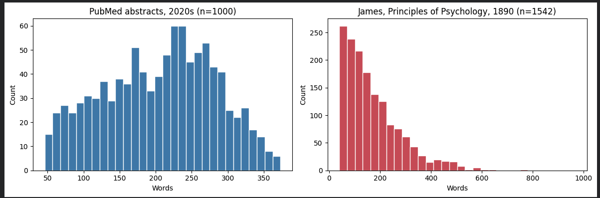

# Chapter 4 — Two Shapes on One Page

The session opened with a bad idea. I'd just read a Richard Hamming lecture — a 1995 talk to navy engineers about style, learning to learn, the unexamined life — and I wanted to fold it into the analysis. Claude pushed back. Not today. The book records what actually happened, and what was meant to happen today was the first two-point comparison on sub-question 2. One 19th-century text, one 21st-century dataset, side by side. Adding a third thing before the first two were done would dilute it. The Hamming text got saved into `/data/raw/` for a future session. Good. Move on.

The source I picked was William James, *The Principles of Psychology*, Volume 1, 1890. He sits exactly on the hinge the project is trying to map — still writing in the old introspective voice, already trying to build psychology as a science. If the language of consciousness really did shift from 1800 to now, James should be visibly in between.

Downloading the book from Project Gutenberg was three lines of Python. Opening it was two more. What came out first was not William James. It was 928 characters of Project Gutenberg legal boilerplate, copyright notices, the file's provenance, a Hathi Trust credit. None of it James. The book sat below, wrapped in administrative text at both ends. This is what "real data" looks like. Nobody hands you a clean file. You have to find where the book begins.

I learned to read `"\n"` as a thing. Invisible. Every line ending in a text file is one of these. Finding the first `\n` after the marker line, adding one, taking everything from there down to the closing marker — that was the cut. What came out was William James's actual writing, starting with the title page and the dedication to his friend François Pillon, ending with footnote 617 where he signs off in his own voice: *Why not say 'know'?—W. J.* I'd cleaned a 135-year-old book. It still sounded like him.

Then the problem a book always has and an abstract never does: what do you count? Splitting the file on blank lines gave me 2,650 "pieces." Only about 1,500 of them turned out to be real paragraphs. The rest were titles, chapter headings, footnote fragments, single-word lines — all of them technically separated by blank lines, none of them James thinking about the mind. I threw away anything under 40 words. Arbitrary, defensible, logged.

What remained was measurable. Average paragraph length: 172 words. I'd expected more. The intuition that Victorians wrote long-winded prose and moderns write tight prose turned out to be partly wrong. PubMed's average was 205. James was actually a little shorter on average. The means were in the same ballpark.

The chart told the real story.

PubMed is a hump. It climbs gradually, peaks around 225 words, falls off, and stops dead just past 370. You can see the journal word limit in the shape. The cliff is the rule. James is a ramp with a long tail — most of his paragraphs are short-to-medium, but the distribution refuses to end. It trails off through 500, 600, 800, all the way to a 966-word paragraph he apparently felt was needed. No ceiling. He wrote to the idea, not to the line.

The finding is small. It's not about consciousness yet — it's about form. But form shapes what can be said. A thought that needs 900 words to land cannot land in a modern abstract. The modern scientist breathes in 200-word chunks, every time, because the journal demands it. James had no such master. Whether something is lost in that shift, or just changed, is a question for a later session.

The other lesson came at the end of the session, as a small embarrassment. I'd been working with "PubMed" for two sessions and had never stopped to ask what it actually was. The dataset I loaded is called `ccdv/pubmed-summarization` on Hugging Face — a slice someone packaged up for machine-learning research, not a random sample of all of medicine. The writers are real scientists, but the selection is opaque. Which means the chart title "PubMed abstracts, 2020s" is already slightly too confident. A more honest title would be "1,000 medical abstracts from a subset someone curated for ML." I'll narrow it in a future session. For now, the caveat is on record. The project's working agreement calls this *the sense of drift* — the skill of reading AI output sceptically. Today the drift was mine. Claude walked past it for two sessions. I walked past it too. A simple question at the end — *what is PubMed?* — is what caught it.

Two shapes on one page. One small finding. A methodological lesson. That's the session.
