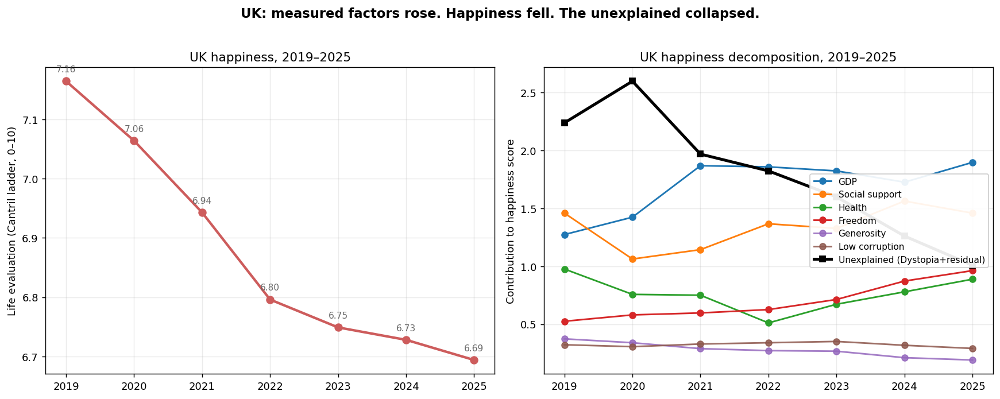
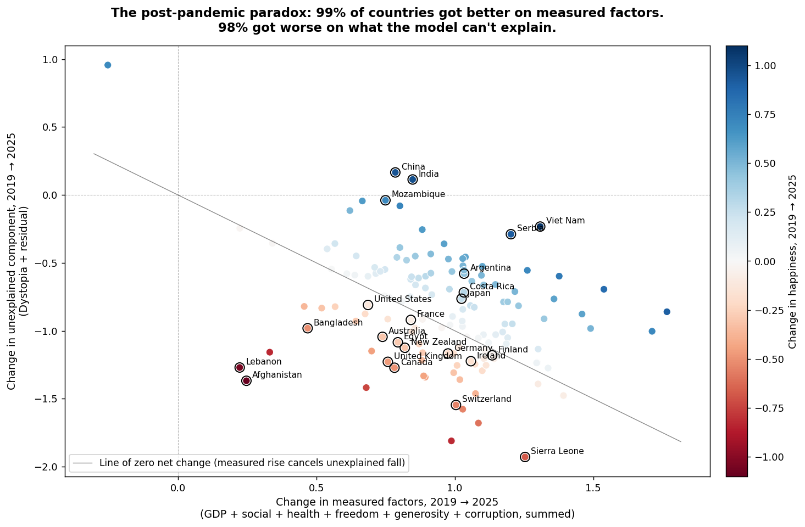

# Chapter 5 — What the model can't see

The book's first question, in plain language, was: does connection matter more than money? The World Happiness Report runs a survey in 140-odd countries every year. It asks people to rate their life on a ladder from zero to ten. It also tracks six things it thinks should explain the answer: income, social support, health, freedom, generosity, and the sense of whether your government is corrupt. I loaded the file, sliced it to 2025, and ran the correlations. Social support and income came out tied — 0.812 and 0.799 — which is to say the first question did not get a first answer. A thousandth of a point is not a winner. That was as far as I'd got when a different question came up, by accident, and swallowed the chapter.

The different question was: **why is the UK no longer happy?**

In 2019, the UK rated its life at 7.16 on the ladder. In 2025 it rates its life at 6.69. That is nearly half a point gone in six years, which doesn't sound like much until you realise that half a point on this scale is roughly the gap between Denmark and Slovenia. The UK has moved that distance downward. So have Canada, Australia, New Zealand, Ireland, and, to a smaller extent, the United States. Switzerland too. This is a widely noted pattern and every columnist has a favourite cause — phones, housing, identity politics, loneliness, the empty churches, the absent children, the vanishing third places. I did not come looking for any of them. I came looking for a correlation. What I found was a hole.

Here is what happened to the UK between 2019 and 2025, broken into the six things the WHR measures.

GDP went up. Not a little — the UK's income contribution to its own happiness score rose by 0.62 points, more than the entire fall in the score. Social support stayed level. Health flickered but ended the period slightly lower. Freedom to make life choices rose sharply — British people in 2025, on average, report feeling freer to decide the shape of their own life than they did in 2019. Generosity fell a bit. Corruption barely moved. If you added all of that up and handed it to a WHR modeller in 2019, they would have told you the UK was on course to be about three-quarters of a point *happier* in 2025 than when they made the prediction. Instead it is half a point less happy. Add those two numbers together: the UK is about 1.2 points lower than its own model says it should be. That missing 1.2 points has to go somewhere. It went into the black line on the right-hand chart, which the report calls *Dystopia + residual* — the part of a country's happiness the six factors cannot explain. In the UK, across six years, that part collapsed.

This is a stranger finding than it first looks. A residual is supposed to be small random error — the scrap at the edge of an otherwise tidy model. If it were random, half the UK's neighbours would have residuals that grew and half that shrank, and the whole thing would wash out when you looked across countries. Scrap has no business going anywhere systematic. Except that it went somewhere systematic.

This is the same calculation — measured factors on one axis, unexplained component on the other — done for every country that has complete data for both 2019 and 2025. One point per country. Colour is the country's net change in happiness: blue is happier, red is less happy, white is level. If residuals were random scrap, the cloud would be a fuzz around zero. It is not. **Ninety-nine percent of countries moved to the right**: their measured factors collectively improved. **Ninety-eight percent moved downward**: their unexplained component fell. The cloud sits in a single quadrant — measured factors up, unexplained down. The diagonal line on the chart is the line of zero net change; countries exactly on it gained as much in their measured factors as they lost in the residual, ending up flat. Countries below and to the left of it got less happy. Countries above and to the right got happier. The UK, Canada, Switzerland, Sierra Leone, and Lebanon are the bottom-left cluster where the loss in the residual wiped out the gains and then some. Viet Nam, India, China, Serbia, Costa Rica, Argentina are the rarer species in the top-right, where the residual held steady or rose and the measured gains actually showed up in people's lives.

The global average tells the story in three numbers. Measured factors rose by 0.94 points across these 141 countries. The unexplained residual fell by 0.84 points. Net happiness moved by 0.10 points. *The world's happiness dashboard thinks we are having the best six-year stretch in its data. Actual humans, when asked, disagree.* And they disagree in a way that is invisible to the dashboard.

So what is in the residual, if it is not noise? By construction, it is anything that moves between countries and years and affects how people rate their lives and is not one of: income, number of people you can count on, healthy life expectancy, freedom to make life choices, charitable giving last month, perceived corruption. Almost every interesting thing about being alive is not on that list. Meaning is not on it. Purpose is not on it. Children are not on it, and neither is the absence of children, and neither is whether you believe your children will have a better life than you did. Religion is not on it. Community — the thick kind, with rituals and obligations and names — is not on it, though a thin proxy is. Loneliness is not directly on it. Trust in institutions separate from corruption is not on it. Hope is not on it. Screens are not on it. Housing is not on it.

The book *Thinking in Wholes* argues that most of what is wrong in modern life comes from treating connected things as if they were separate, and that the cure is learning to see and work with the whole. When I started this chapter I thought I was going to test one of its small specific claims — that connection beats wealth — and report that the first test came back inconclusive. What I found instead was that the whole dashboard the book is quietly criticising is broken in exactly the way the book predicts. The WHR has picked six variables, drawn from economics and liberal political theory, and built a model that explains most of the variation in life evaluations across countries at any single moment. And when you run that same model through time, between 2019 and 2025, it fails quietly and globally, in the same direction, by roughly the same amount, in almost every country. The part of human wellbeing that moves in the 2020s is the part the model does not measure.

I am not going to claim I know what the missing variable is. Anybody who hands you one name for it — phones, god, family — is selling something. But the shape of it is unmistakable. It is the *wholeness* the book is named after. It is what the WHR's authors, in the 2019 edition, could still plausibly claim to be capturing with "social support." It is no longer captured by that. If this chapter has a finding, that is the finding: **the model that's supposed to measure how well humans are doing has stopped being able to see what is hurting them.**

The UK's half-point fall is a concrete case of the general fact. The general fact is that wherever you are reading this, something substantial is probably pulling your country's self-reported life evaluation below what its income and freedom and health would predict. Whatever it is, it is global. Whatever it is, the dashboards do not have a column for it. Whatever it is, the rest of this investigation is going to try to name.

The next session loads thirty years of income and development data and asks a complementary question: did growth and development actually go together, or have they decoupled, as the book claims? I do not know yet. I am starting to trust that the data will tell me something I didn't plan for — because it just did.
