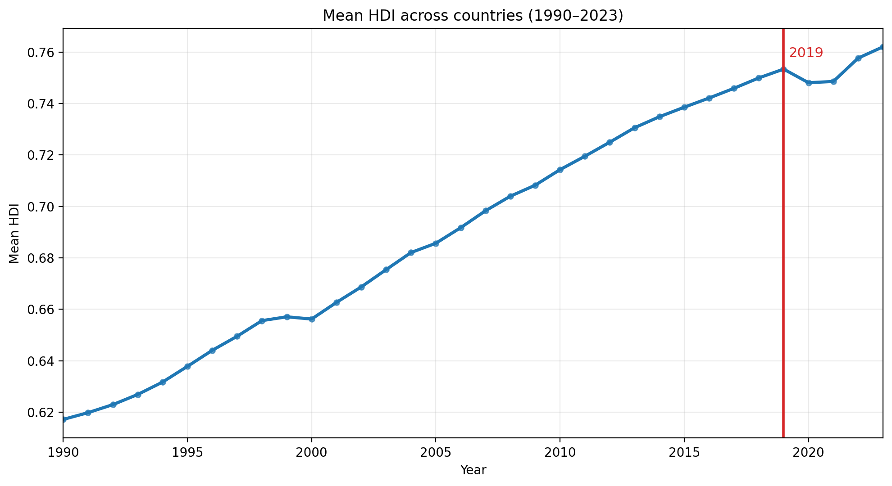
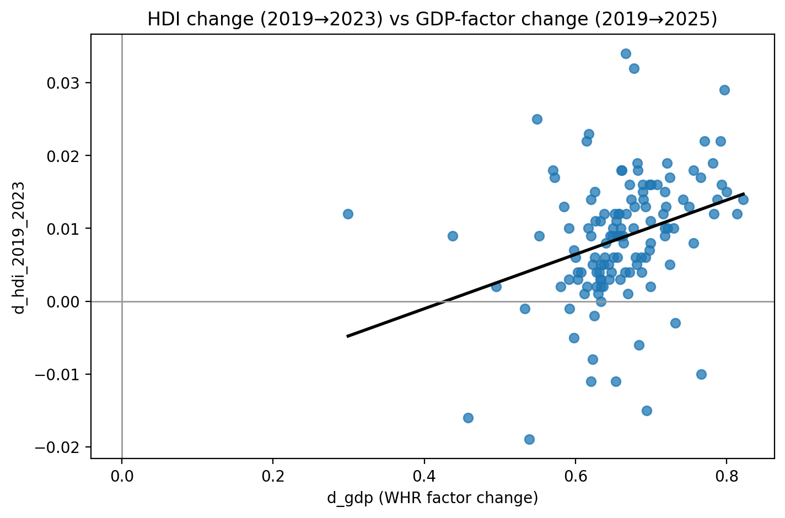
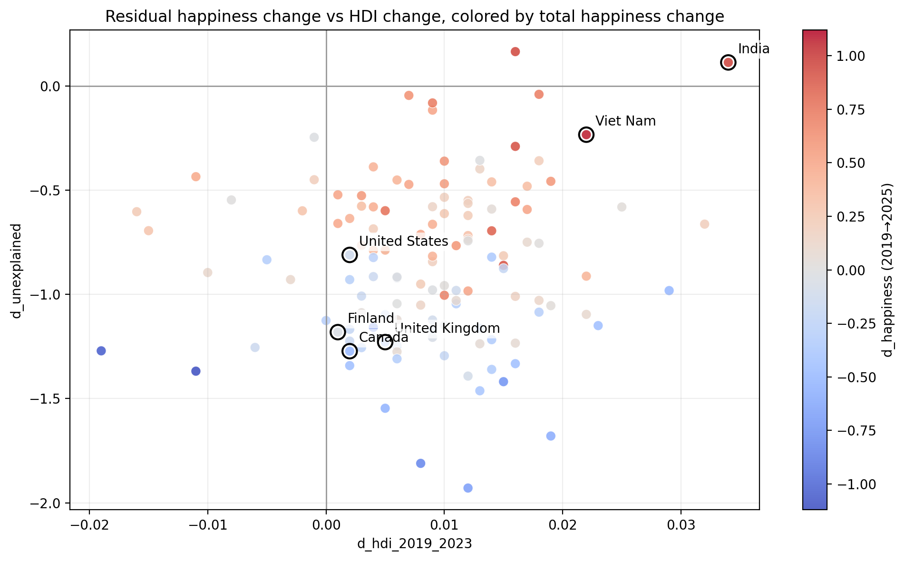
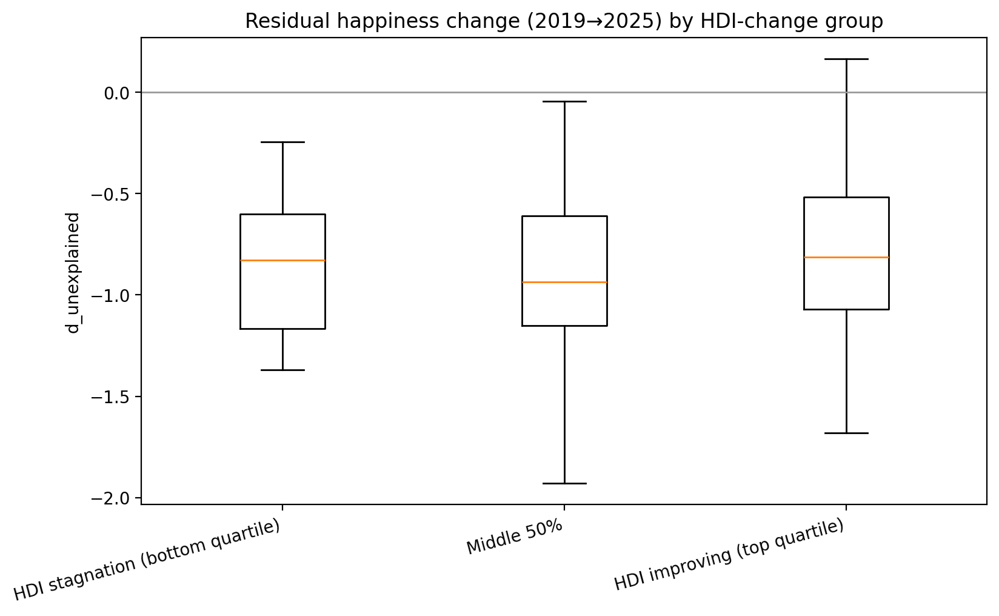
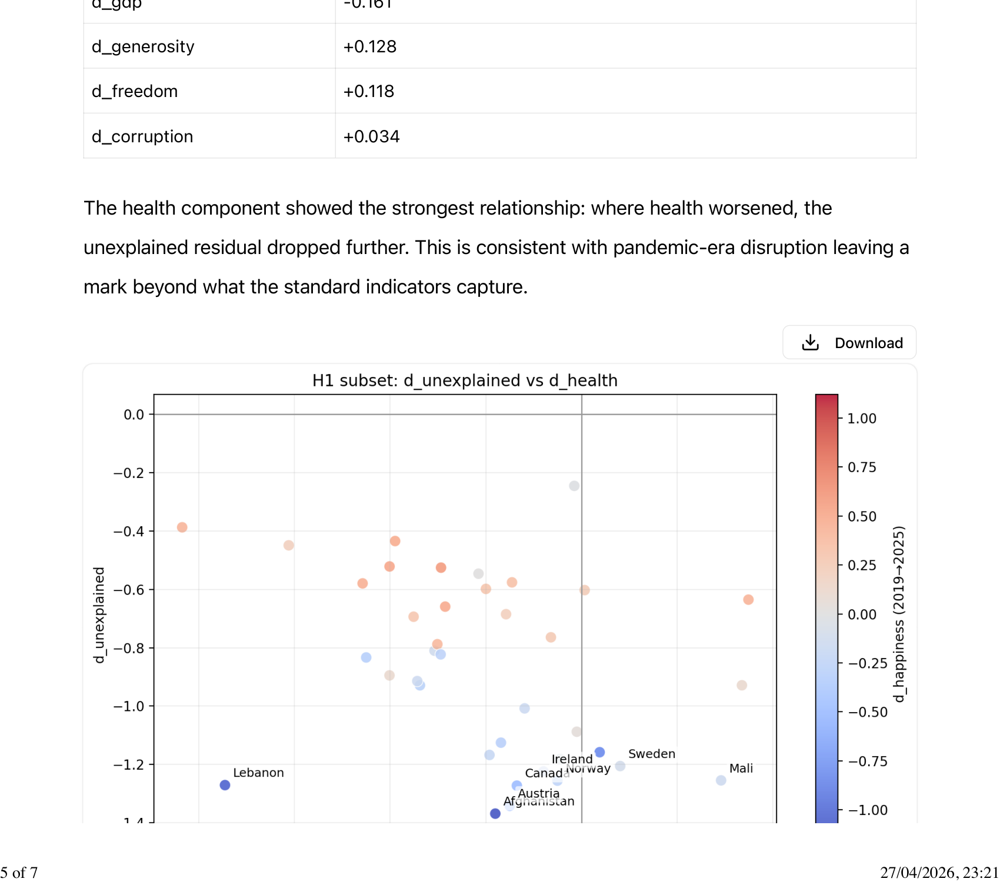
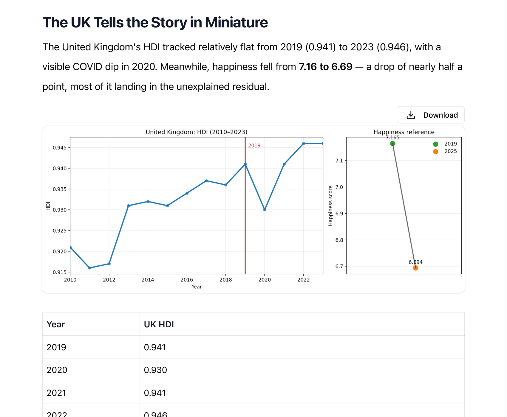

# Chapter 6 — The Dashboard That Couldn't See the Drop

The obvious follow-up question after Session 4's finding was: maybe what's falling in the residual is just development. Maybe the countries where people are getting less happy despite rising incomes are the same countries where the broader picture — health, education, life expectancy — has also quietly stalled. If that were true, it would be a cleaner story. The dashboard missed it because it was looking at the wrong development metric, not because something fundamentally unmeasurable was happening.

So I loaded thirty years of Human Development Index data — 206 countries, every year from 1990 to 2023 — and asked that question properly.

The HDI is a composite. It takes three things: how long people live, how many years of education they get, and how much income they have, and rolls them into a single number between zero and one. It was designed specifically to push back against GDP-only thinking, to say: wealth without health and education isn't really development. It's been running since 1990. It's the closest thing we have to a thirty-year record of whether human lives are actually improving.

From 1990 to 2019, the global mean HDI climbed from 0.617 to 0.753. Thirty years of steady, consistent improvement. Then 2020 happened. The line dipped — pandemic — and then recovered, but by 2023 it had only reached 0.762. The post-2019 period is visibly flatter than anything in the three decades before it. That's already interesting: the era in which happiness started falling is also the era in which the pace of human development slowed.

But that isn't the main finding.

When I merged the HDI panel with the happiness change data from Session 4, the correlation between GDP-factor changes and HDI changes came out at 0.32 — moderate, statistically significant. Countries that got richer in the WHR sense also tended to improve on health and education. So the clean version of what I expected to find — that growth stopped translating into development everywhere — isn't true. On average, they still move together.

But averages hide a lot. Look at the scatter plot. The relationship is real but the spread is enormous. A large cluster of countries sits on the right side — GDP factor rose — but near zero on the vertical axis — HDI barely moved. Those are the countries I'm interested in.

Filter to countries where the GDP factor rose but HDI moved less than 0.005 — essentially flat. Thirty-eight countries fit. Nearly a third of the dataset.

Here's the part I didn't expect: the list includes Afghanistan and Austria. Lebanon and Norway. Canada, Finland, Germany, New Zealand, the United Kingdom, the United States. Crisis-affected states and wealthy stable democracies, sitting in the same bucket. If this were purely about political collapse or economic catastrophe, Afghanistan would be on one list and Finland on another. They're not. Something is cutting across all of them.

And in every one of these 38 countries, the happiness decline — like the global pattern from Session 4 — landed in the unexplained residual. GDP rose. Human development barely moved. Happiness fell. The fall isn't in the measured factors. It's in the part the model can't see.

I then tested the obvious hypothesis: maybe HDI stagnation *is* what drives the residual down. If that were true, you'd expect a clear relationship between the two — countries where HDI moved less would have bigger residual drops. The correlation came out at r=0.11, not statistically significant. HDI stagnation, on its own, doesn't predict the residual drop.

UK, US, Canada and Finland sit in the lower-left, where the residual collapsed. India and Viet Nam are alone in the upper-right, where it held. Most countries cluster around the middle, and the slope through them is barely there — that's the 0.11.

Split countries into three groups by HDI change — stagnating, middle, improving — and the boxplots tell the same story:

The distributions barely differ. The group where HDI improved most doesn't have noticeably smaller residual drops than the group where HDI stagnated. The dashboard that was designed to catch what GDP misses is also missing this.

Only when you control for GDP does HDI start to look relevant (p=0.062, borderline significant). Which means: it's not development stagnation by itself. It's something about the combination — money improving while broader development doesn't — that seems to matter. But even then, the relationship is weak. Whatever is driving the residual isn't primarily captured by HDI either.

Inside the 38-country group, I checked which of the WHR's own factors correlated most strongly with the residual decline. Health was the strongest signal at −0.306: where health worsened, the residual fell further. This is consistent with the pandemic leaving a deeper mark than the recovery statistics suggest — not just in mortality numbers but in how people experience their daily lives.

But health alone doesn't close the gap. No single factor does. The post-2019 wellbeing decline is multi-causal — that's the honest result, and it matters, because it means you can't fix it by targeting one thing.

The United Kingdom makes all of this concrete. Its HDI went from 0.941 in 2019, dipped to 0.930 during COVID, and recovered to 0.946 by 2023. By the standard development scorecard, the UK is essentially where it was and then some. Meanwhile, happiness fell from 7.165 to 6.694. Nearly half a point. If you had handed a development economist the UK's HDI trajectory in 2019 and asked them to predict happiness in 2025, they would have gotten it wrong by half a point. The tool designed to capture what GDP misses also missed it.

This is the finding that closes the loop opened in Session 4. The WHR's six factors missed the happiness drop. The HDI misses the happiness drop. The thing that's falling between 2019 and 2025 in countries like the UK, Canada, Austria, and Norway is not income stagnation, not health decline, not education decay, not any of the variables that development economics has built its measurement apparatus around. It is something that all of those frameworks were not designed to see.

This is the failure mode the book *Thinking in Wholes* keeps returning to: when institutions measure what machines measure — output, efficiency, profit — and ignore what social systems require — trust, purpose, the quality of the relationships between people — their dashboards stop tracking what is actually happening. The GDP captures transactions. The HDI captures education years and life expectancy. The WHR captures six survey-based proxies. None of them are measuring the texture of daily life: the sense of meaning, the thickness of community, the presence or absence of institutions people trust, the feeling that the future is open. Those things are in the residual. They're what's falling.

Session 5 ruled out two large explanations: income stagnation, and development stagnation. The investigation has narrowed the problem significantly. What remains is something that shows up in how people describe their lives when asked — but not in any standard economic or development metric. That's where Session 6 is going: into the language itself, to ask whether the shift the book describes is visible in what people actually say.

I don't know what we'll find. That's the point.
