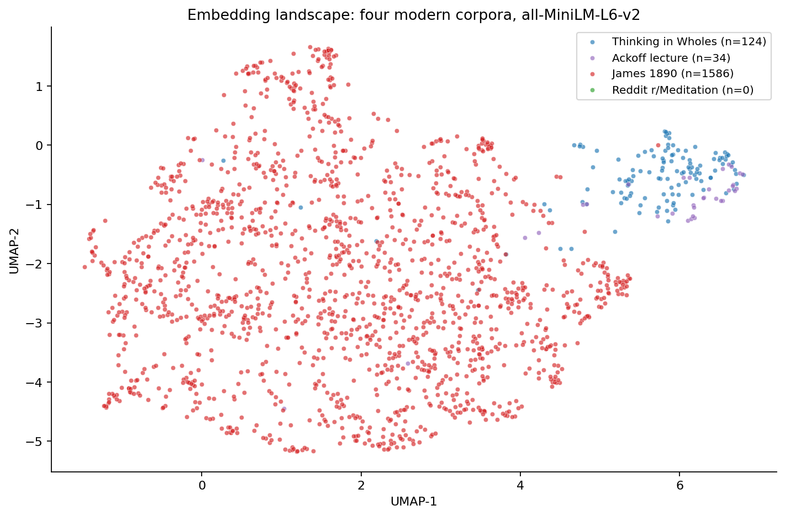

# Chapter 7 — What the Model Heard

Going into the language itself meant building a different kind of tool. Six chapters of country-scale numbers told me what the dashboard couldn't see; for what came next I needed something that could read across texts and notice when two pieces of writing were saying the same thing in different words. The tool for that, in 2026, is an embedding.

An embedding is a list of numbers — a vector — that a neural network produces from a piece of text. The model has been trained on billions of sentences in a way that gradually shapes the geometry of its output: paragraphs about meditation end up near each other in vector space, paragraphs about tax policy end up near each other, and the two regions end up far apart. The vector itself is opaque. For the small model I started with, every paragraph becomes 384 numbers, and no individual number means anything legible. The geometry between vectors is what carries the signal.

To compare two pieces of text, the standard move is cosine similarity — a single number between minus one and plus one that measures whether the two vectors point in the same direction. Plus one means very similar meaning. Zero means unrelated. For text in this kind of model the value is almost always between zero and one because the vector space doesn't really use the negative half. Two paragraphs of meditation prose come back at 0.7 or 0.8. Two paragraphs that share nothing in common come back at 0.05 or 0.10.

I loaded four corpora — *Thinking in Wholes* itself, the Ackoff lecture, William James's *Principles of Psychology* from 1890, and a sample of Reddit r/Meditation posts. Three of the four loaded cleanly. Reddit returned HTTP 403 on every endpoint. The public JSON API has been hardened against unauthenticated scraping since 2023; getting a meaningful sample now needs OAuth, or a HuggingFace mirror, or a static archive. I noted the absence and ran the analysis on the three corpora that loaded — 124 paragraph-level chunks of *Thinking in Wholes*, 34 of the Ackoff lecture, 1,586 of James 1890. Total 1,744 chunks, embedded in 4.1 seconds on a Colab T4 with `all-MiniLM-L6-v2`.

The first read was a sanity check. The five most-similar pairs inside *Thinking in Wholes* were all citation entries finding the prose that cited them. The Hopfield/Hinton 2024 Nobel reference hit the prose chapter that introduces complexity science at cosine 0.84. The Future of Jobs Report citation hit its own setup paragraph at 0.81. The Harvard Study of Adult Development citation hit the Waldinger and Schulz paragraph at 0.75. None of these are surprising. They are what the model is supposed to do — recognise that two pieces of text about the same thing belong adjacent in the geometry. If the sanity check had failed I would have stopped there.

The second read was Ackoff against *Thinking in Wholes*. The two texts are explicitly in the same intellectual lineage; *Thinking in Wholes* draws from Ackoff. Top pair, cosine 0.80, on the Ackoff paragraph defining a social system — *"a social system has purposes of its own, its parts have purposes of their own, and it's part of a larger system which has purposes of its own"* — and the *Thinking in Wholes* paragraph that develops the same triadic structure. The next four pairs sat between 0.69 and 0.78. The model was finding the lineage, not finding kinship. Same author tradition, paraphrased.

Then the third read. James 1890 against *Thinking in Wholes*. This was supposed to be the long-shot read — a 19th-century psychology textbook against a 2026 systems-thinking book. I expected James and *Thinking in Wholes* to come back distant. They are nominally about different subjects. James writes about consciousness, attention, memory, perception. *Thinking in Wholes* writes about organisations, societies, and how to think systemically about both.

Top pair, cosine 0.5376. Below the within-Ackoff-and-Thinking-in-Wholes numbers, but well above what a random pairing of paragraphs would produce.

The James paragraph, from the 1890 book:

> *"In a system, every fact is connected with every other by some thought-relation. The consequence is that every fact is retained by the combined suggestive power of all the other facts in the system, and forgetfulness is well-nigh impossible."*

The *Thinking in Wholes* paragraph:

> *"This is what systems thinking says: the most important things are never in the parts. They are in the connections between the parts. And for three and a half centuries we have been trained to ignore the connections and study the parts."*

This is the moment the bundle had asked for. The model surfacing something I hadn't told it to look for. Two passages, 136 years apart, written by people who would have had no reason to be in conversation, doing the same intellectual move. James is talking about how human memory holds onto facts. *Thinking in Wholes* is talking about how organisations and societies hold themselves together. Different domains. The same structural claim: the meaningful properties are in the relationships, not the parts.

I did the falsification check the bundle prescribes — read both passages and decide honestly whether the resonance is real or whether the model is matching on shared rare words. The shared vocabulary is real: both contain *"system"* and both lean on the connectedness language. But underneath the shared words is a shared structural claim, which is what I think the model is responding to. Verdict: meaningful resonance, not a vocabulary trick.

The same pattern shows up in the James-against-Ackoff read. Top pair at cosine 0.58, between James writing about how perception isolates qualities — *"if any single quality or constituent... have previously been known by us isolatedly"* — and Ackoff lecturing on what he calls the inheritance of analytical thinking, *"Analysis as the Method of Inquiry... we developed a method of inquiry which became pervasive in the Western world."* James is doing the method from inside. Ackoff is naming it from outside, eighty years later, as the thing the field needs to outgrow. Same intellectual operation. The model places them adjacent.

The 2D projection above is for the eye, not for measurement — the distances aren't the actual cosines. But the structure is real. James's red cloud takes up most of the chart. *Thinking in Wholes* in blue and Ackoff in purple form a tight overlapping cluster on the right edge, sitting practically on top of each other. A handful of red James points lean rightward into the systems-thinking region — those are the James paragraphs that produced the pairs above. The bulk of James — the chapters on physiology, on neural structure, on attention — sits in its own neighbourhood. The model has placed two clouds in the same room: a 1890 one and a 2026 one, mostly separate, but overlapping precisely where James writes about systems and connections.

The Reddit r/Meditation entry shows in the legend with `n=0`. Honest about the data we tried and didn't get. The fourth corpus the bundle had planned would have populated the empty middle of the chart. Session 9 will revisit it.

I want to be careful about the size of what I'm claiming. A cosine of 0.5376 on the top James-Thinking-in-Wholes pair is not the kind of number that closes a question. It is the kind of number that suggests a question worth holding open. Two pairs is a small sample for a falsification check. The model's training data was modern English, which probably suppresses cross-era cosines below their true value. None of this is a result yet.

But it is the first piece of language-level evidence the investigation has produced. The Wholeness Investigation's hook — *naming what's in the residual*, the unmeasured thing that fell across 141 countries between 2019 and 2025 — has so far been a country-scale puzzle. This session is the first time the question has been asked through text. The unexpected piece is that the language of *Thinking in Wholes*, written four years ago, is already present, in fragments, in a textbook from 1890. Whatever the shift the book describes is, it is not new. It has predecessors.

The next session points the same tool at the oldest writing we have.
