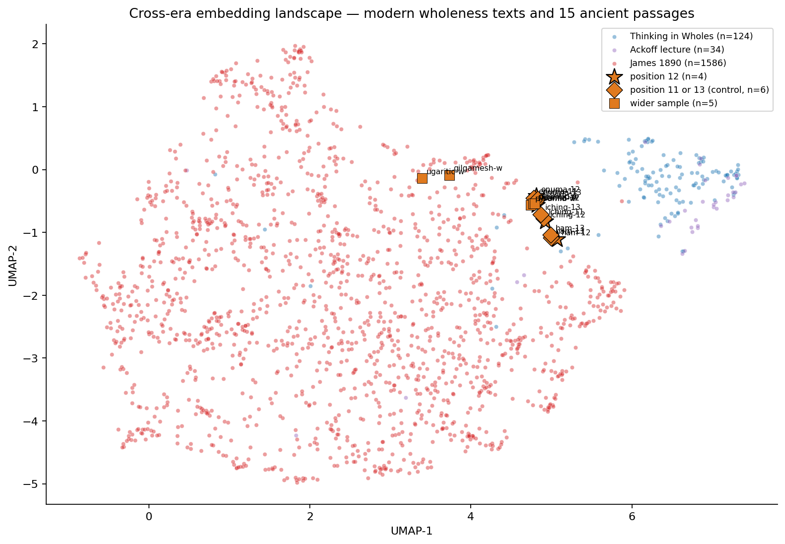

# Chapter 8 — The Oldest Voices

The next session pointed the same tool at the oldest writing we have. The plan, on paper, was clean: take seven texts from civilisations that had no confirmed direct contact — Hammurabi, Enuma Elish, the I Ching, the Descent of Inanna, the Pyramid Texts, Gilgamesh, the Ugaritic Baal cycle — and ask whether the passage at structural position twelve in each of them clustered together in the embedding space. The conjecture, drafted in the planning bundle for this session, was that something measurable would surface across that small set. The obvious worry, drafted in the same paragraph, was that "I picked the position-twelve passage from each text" is itself a selection criterion, and that any seven things selected by a rule will look more similar to each other than seven things sampled at random. [Falsification](../05_glossary.md#falsification) was the point of the test: write the prediction down, run it, accept whatever the data say.

Verification reading, between sessions, narrowed the corpus from seven texts to a more honest fifteen-passage set. Three of the seven planned texts couldn't deliver a comparable position-twelve passage at all. The Pyramid Texts use a spell numbering that comes from twentieth-century scholarship, not from the inscriptions themselves; what Faulkner calls Spell 12 isn't carved in the Unas pyramid, which has its own internal sequence. The Standard Babylonian Tablet 12 of Gilgamesh is the appended Sumerian source about the netherworld, distinct from Tablets 1–11, and the public-domain Gilgamesh fragments don't include it. The Ugaritic case is the cleanest illustration of the problem: KTU 1.12 is the twelfth tablet in the Dietrich/Loretz/Sanmartín museum catalogue, not the twelfth section of any work. The number is an archive index. Asking whether KTU 1.12 clusters with Hammurabi Law 12 because they share the digit twelve is asking whether two unrelated things share a label. The hypothesis as originally drafted assumed all the position-twelves would be comparable across texts. They aren't. Four texts — Hammurabi, Enuma Elish Tablet 1, the I Ching, and Inanna's Descent — do have a comparable position-twelve unit. The other three were folded into the analysis as a wider sample of ancient prose, with the discrepancy named openly rather than papered over.

What that left was a four-passage position-twelve set, plus three position-eleven and three position-thirteen controls (Inanna isn't numbered, so it contributes only on the twelve-side), plus five wider-sample passages from the three texts whose twelves don't translate. Fifteen verified passages in scholarly English translations from 1899, 1903, 1921, 1972, 1983, 2010, and 2018. All of them were embedded into the same vector space as the three modern corpora from the previous session, and the same [cosine-similarity](../05_glossary.md#cosine-similarity) machinery was pointed at them. Both pre-registered tests were designed before any of the numbers were looked at. The first asks whether the four position-twelve passages cluster together more tightly than four randomly-sampled passages from the same fifteen-passage pool. The second asks whether the modern wholeness texts — *Thinking in Wholes* 2026, the Ackoff lecture, James 1890 — sit closer to the position-twelve passages than to the wider ancient sample.

The falsification design for the first test is a [permutation](../05_glossary.md#permutation-test): pool all fifteen ancient passages, sample four at random, take the mean pairwise cosine of those four, repeat ten thousand times. That gives a null distribution of "what kind of mutual similarity does an arbitrary four-passage selection produce?" The observed sim_12 — the actual mean pairwise cosine among the four position-twelve passages — sits somewhere in that distribution. If it sits at the ninety-fifth percentile or higher, the cluster has survived its first falsification. If it sits near the median, the cluster is selection bias. Because hexagram eleven of the I Ching is the explicit yin-yang complement of hexagram twelve in the original text — they are paired at the source, not by my choice — the test was run twice: once including iching-eleven in the null pool, and once excluding it as a sensitivity check.

The pre-registered prediction was that sim_12 would clear the ninety-fifth percentile. The result was that it did not. With the full fifteen-passage pool, sim_12 of +0.2310 sits at the forty-fifth percentile of the null distribution, with one-sided [p of 0.55](../05_glossary.md#p-value-statistical-significance). Excluding iching-eleven, sim_12 lands at the forty-ninth percentile, p of 0.51. Both readings put the observed cluster slightly *below* the median of arbitrary four-passage selections from the same corpus. The four position-twelve passages are not unusually similar to each other; they are roughly as similar to each other as any four ancient passages would be. The twelve-cluster, as a measurable property of these texts, does not survive falsification. The pre-registered prediction is rejected, and the headline of this chapter is that rejection.

Two diagnostic numbers from the same matrix make the result more legible. The mean cosine between each text's position-twelve passage and the same text's position-eleven passage — Hammurabi Law 12 against Hammurabi Law 11, Enuma Elish line 12 against line 11, I Ching hexagram 12 against hexagram 11 — is +0.65. The same number for position-twelve against position-thirteen is +0.58. These are very high. They are the largest cosines anywhere in the ancient corpus. The structural unit the model recognises is "passages from the same text," not "passages at the same position number across texts." A Hammurabi law sits much closer to the next Hammurabi law than it sits to a hexagram or a creation myth. This is unsurprising once stated; it is also why the position-twelve cluster cannot exist as the original framing imagined it. The shared property of "structural position twelve" is dominated, in the embedding geometry, by the unshared property of "from utterly different texts."

The second test produced a different shape of result. Across all 1,744 modern paragraph chunks, the [paired difference](../05_glossary.md#paired-difference-test) between mean cosine to the four position-twelve ancient passages and mean cosine to the eleven non-position-twelve ancient passages came out to +0.0130 — a small absolute number (paired-difference values in this kind of comparison typically sit between −0.02 and +0.02; the sign and reliability matter more than the magnitude). The [bootstrap ninety-five-percent confidence interval](../05_glossary.md#bootstrap-confidence-interval-ci) was [+0.0118, +0.0142], cleanly excluding zero. The [sign-flip permutation](../05_glossary.md#sign-flip-permutation) p was effectively zero. All three modern corpora individually contribute: 75.8 per cent of *Thinking in Wholes* chunks are paired-positive, 79.4 per cent of Ackoff, 69.5 per cent of James. The pre-registered prediction is supported. Modern wholeness texts are reliably closer to the position-twelve passages than to the wider ancient sample.

The qualitative receipts complicate the read. The five highest cosine pairs between any modern chunk and any position-twelve passage are all the same shape: a James 1890 paragraph against I Ching hexagram twelve in James Legge's 1899 translation, at cosines from 0.54 down to 0.46. That alignment has a less interesting explanation than wholeness register. Legge's I Ching reads in formal late-Victorian English, with measured cadence and abstract moral language; James's *Principles of Psychology* reads in formal late-Victorian English, with measured cadence and abstract psychological language. Two voices written within nine years of each other, in the same prose [register](../05_glossary.md#register-linguistic), will sit close to each other in vector space whether or not their subject matter is related. The strongest qualitative signal in the cross-era test could be a translation-style match, not a wholeness-language match. The aggregate paired-difference test still holds — *Thinking in Wholes* and the Ackoff lecture, both written in late twentieth- or early twenty-first-century modern English, also show the lift toward position-twelve, which makes a pure-Victorian-English explanation harder to sustain — but the question is open enough that Session 11's topic-modelling work needs to control for translator era and translator style before this particular result can be claimed as cross-era resonance on the wholeness register specifically.

The two-dimensional projection makes both findings visible in one frame. Thirteen of the fifteen ancient passages cluster tightly together in one orange knot near the right side of the chart, near but not inside the *Thinking in Wholes* and Ackoff cluster. The position-twelve stars, the position-eleven and position-thirteen control diamonds, and the pyramid-texts wider squares are all mixed together in that knot, structurally indistinguishable. The two ancient outliers — the Pennsylvania Tablet of Gilgamesh and the two Ugaritic passages from KTU 1.4 and 1.23 — drift left into James's neighbourhood, because narrative prose poetry sits closer to James's sustained prose than to law-codes and cosmogonies. The chart confirms what the matrix says. There is no measurable position-twelve separation in this corpus. There is a measurable affinity between modern wholeness texts and one specific ancient passage, hexagram twelve in Legge's translation, which the aggregate test detects and the qualitative receipts make visible. The visual story is consistent with the numbers.

The Wholeness Investigation began with a residual — the fall of the unexplained component of the World Happiness Report across 141 countries between 2019 and 2025, after the six measured factors had been accounted for. The hook of this phase is *naming what's in the residual.* Session 8 was supposed to extend a thread from Session 7 — the unplanned 1890–to–2026 resonance — back across five thousand years. The cleanest reading of the result is that it didn't. The position-twelve cluster, as a coherent thing, does not exist in the embedding geometry of these passages. Hypothesis 3 — that the language of wholeness in modern writing is reaching for a register the oldest texts already used — is not advanced by this session. It is, however, sharpened. If wholeness language is in the oldest texts, it is not at position twelve, and the framing needs to be different. If the cross-era resonance with hexagram twelve is real and not a translation-register artefact, the next test needs to control for the artefact. Filing a candidate name as selection bias is what falsification is for. The next session has its work waiting: Reddit, the modern lay-language voice that this run still couldn't reach.
