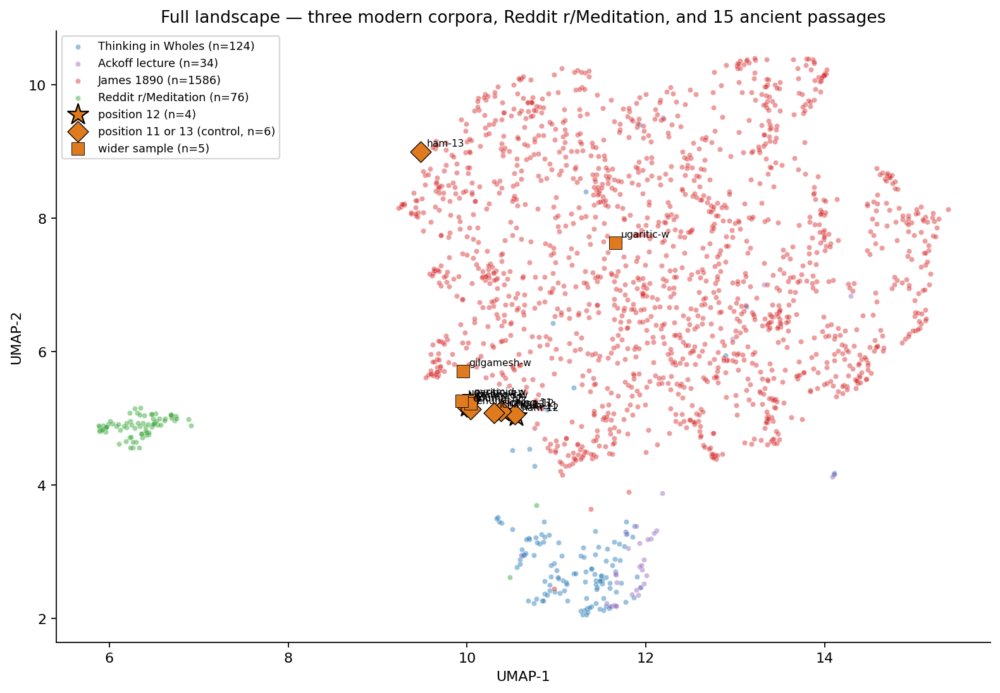

# Chapter 9 — Reddit Lands

The next session had its work waiting: Reddit, the modern lay-language voice that two earlier runs couldn't reach. Sessions 7 and 8 had both pointed the embedding pipeline at Reddit's anonymous JSON endpoint and both came back with HTTP 403. The fix wasn't to keep banging on the live API. It was to switch to a static dataset published on Hugging Face — `sentence-transformers/reddit-title-body`, seven million Pushshift-sourced Reddit posts spanning mid-2010 to mid-2021, pre-filtered for quality. Streaming that dataset, filtering the records to subreddit equals "Meditation," took thirty seconds and 500,000 rows scanned to surface 76 posts that fit the 20-to-300 word window. The session ran with what it got. r/Meditation turns out to be sparse in this dataset — about one post in every six thousand — and the safety bound on the scan stopped at 81 Meditation rows total. Seventy-six was enough.

What landed was the missing fourth modern voice. Until this session the project had three modern corpora — *Thinking in Wholes* (a 2026 systems-thinking book), the Ackoff lecture (a late-twentieth-century critique of analytical thinking as a method), and William James 1890 (a Victorian psychology textbook) — all of them formal, sustained, paragraph-length argumentative prose. Reddit r/Meditation is none of those. It is short, conversational, often question-form, first-person personal reports about doing meditation. *"I have recently been attempting to meditate but whenever I am able to clear my mind, my body forgets to breathe. Then I realize I need air, and my head becomes full of thoughts again. Any suggestions?"* That is the modern lay register. The internal coherence of the Reddit cluster — mean cosine 0.336 within source — is actually higher than any of the formal corpora's, because meditation discourse is tight and self-similar. People on r/Meditation talk about a small set of things in a small set of ways: distraction, breath, sitting longer, the feeling of progress, the felt experience of attention turning inward.

The first interesting result was where Reddit landed. The mean cosine between Reddit and each other modern corpus split sharply. Reddit's mean cosine with James 1890 came in at 0.1364 — about three times higher than its mean cosine with *Thinking in Wholes* (0.0450) or the Ackoff lecture (0.0480). Whatever Reddit shares with the other three modern corpora, it shares more with James. Reading the top pairs explains why. Four of the five highest-cosine Reddit↔James pairs hit the same paragraph in James, chunk #810:

> *"When I try to remember or reflect, the movements in question, instead of being directed towards the periphery, seem to come from the periphery inwards and feel like a sort of withdrawal from the outer world."*

That paragraph in James is a phenomenological description of introspection. The Reddit posts paired with it are first-person reports of sitting practice — the felt sense of attention pulling away from external thought, the strange physical sensations during meditation, the experience of trying to redirect a wandering mind. Different prose register, same subject matter. The model is picking up on the topical overlap. This is the cleanest cross-era result the project has produced — a 19th-century psychology textbook and 2010s lay meditation prose describing the same kind of moment, 130 years apart, in semantically adjacent vector neighbourhoods. Real resonance, not vocabulary. James was trying to characterise introspection from outside the practice, in the formal scientific register of his era. The Reddit posters are reporting their own sitting from inside the practice, in the conversational register of theirs. The model puts them in the same room because the topic is the same.

The second result was the one this session was set up to test. Session 8 had found a small but reliable lift — modern wholeness texts sat closer, on average, to the four ancient passages at structural position twelve than to the wider ancient sample. The interpretation was open. The lift could be a *wholeness-register* signal: modern wholeness language reaching across eras for the same intellectual move the oldest texts already had. Or it could be a *translation-register* artefact: most of the Session 8 lift came from James 1890 sitting close to I Ching Hexagram 12 in James Legge's 1899 translation, and "Victorian English meeting Victorian English" is a much less interesting explanation than cross-civilisation wholeness. Reddit was the right instrument to break the tie. Reddit is modern lay English, written between 2010 and 2021, with no plausible Victorian-prose register and no formal book-or-lecture cadence. If the cross-era lift was wholeness language, Reddit should have shown it too. If it was translation register, Reddit should sit at zero or below.

Reddit's paired-difference toward position-twelve ancient passages, computed exactly as Session 8 computed the others: −0.0045. The number is *negative*. Most Reddit chunks — 58 per cent of them — are *closer* to the wider ancient sample than to the four position-twelve passages. The other three modern corpora landed where Session 8 reported them: *Thinking in Wholes* +0.0154, Ackoff +0.0176, James +0.0127, all between 70 and 80 per cent paired-positive. Three formal-prose corpora cluster in the same +0.012 to +0.018 band. One conversational-register corpus sits below zero. The wholeness-register interpretation of Session 8's lift fails the test cleanly. What tinw, ackoff, james, and the position-twelve ancient passages share is not wholeness language. It is formal-English-prose register: sustained paragraph argumentation, abstract conceptual vocabulary, the cadence of published written work. Hexagram 12 in Legge's 1899 translation reads in formal Victorian English. Modern formal English — whether 2026 systems-thinking, mid-twentieth-century lecture, or 1890 psychology textbook — sits closer to that register than scholarly translations of cosmogonies or law-codes from other periods do. Reddit, written in the register people actually talk about meditation in, doesn't share the formal-prose property and doesn't get the lift.

The cleanest reading of Sessions 7, 8, and 9 together is that the cross-era resonance the project found is a register match between formal English prose and one specific scholarly translation, not a transmission of wholeness language across civilisations. The result is real and replicable. The interpretation needs to change. Hypothesis 3 in its strong form — *the language of wholeness in modern writing is reaching for a register the oldest texts already used* — does not survive the Reddit test. A weaker version might. The cleanest signal that did survive is the Reddit↔James phenomenology resonance: a 1890 textbook describing inward attention and 2010s meditation posts describing inward attention sit semantically adjacent. That is a real cross-era finding, but it isn't about wholeness. It's about how introspective experience is described, and how recognisable that description is across the gap between William James and a Reddit user thirty years younger than James's book.

The chart for this session is the picture Sessions 7 and 8 were missing. Five corpora, one frame. The most striking visual fact is Reddit's isolation. The 76 r/Meditation chunks form a tight green cluster on the far left side, separated by a wide gap from everything else on the chart. James 1890 (red) covers the right two-thirds of the plot in a sustained cloud. *Thinking in Wholes* (blue) and the Ackoff lecture (purple) cluster together at the bottom, slightly below the main James mass. The 15 ancient passages (orange shapes) cluster in the middle of the chart, between James and the systems-thinking corner. The position-twelve stars, the position-eleven and position-thirteen control diamonds, and the wider-sample squares are all crowded into one ancient knot — same as Session 8, the cluster does not separate by position. Reddit's green cluster sits alone, closer to nothing on the chart than it is to its own internal coherence. The picture is consistent with the matrix: Reddit's mean cosine to anything else is below 0.14, while its internal cosine is 0.336. The model treats r/Meditation prose as its own register, sufficiently different from formal published written English to live in its own neighbourhood of the geometry.

The Wholeness Investigation began with a residual — the gap across 141 countries between what the World Happiness Report's six measured factors predict and what people actually report. The hook of Phase 3 is *naming what's in the residual* through language. Three sessions in, two candidate names have been filed honestly. Session 8 filed the structural-position-twelve cluster as selection bias. Session 9 has now filed the wholeness-register-across-eras interpretation of the cross-era lift as not what the data actually show; what they show is a formal-prose register effect. The investigation is two candidate names down, with the residual still unnamed. Session 10 turns to the World Values Survey for a different angle on the question — does cultural variation in connection-versus-isolation language correlate with the unmeasured drop the WHR is missing — and Session 11 runs topic-modelling on the modern corpus to test whether what tinw, ackoff, and james share with the formal ancient texts is the same set of topics or just a stylistic resemblance. Phase 3 has cleared two candidates. Two sessions remain to surface a third.
